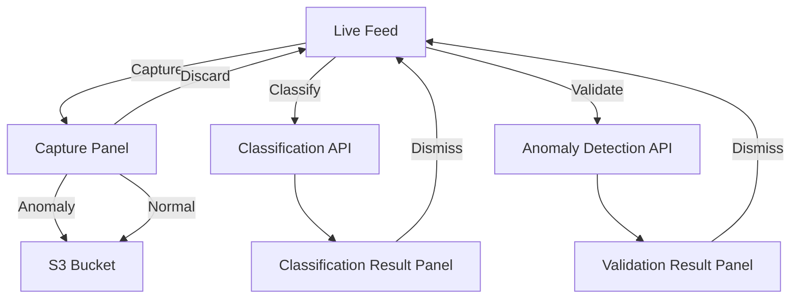
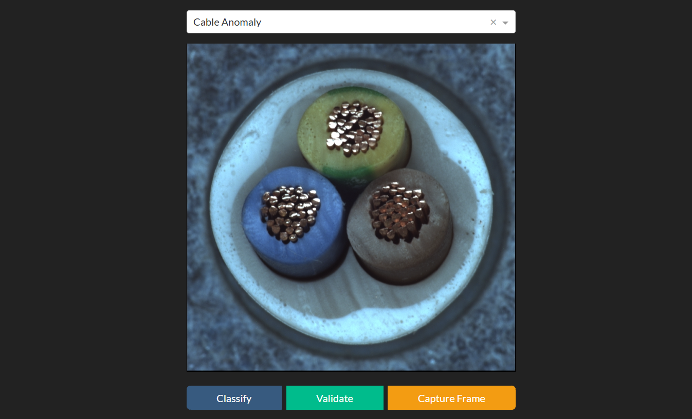
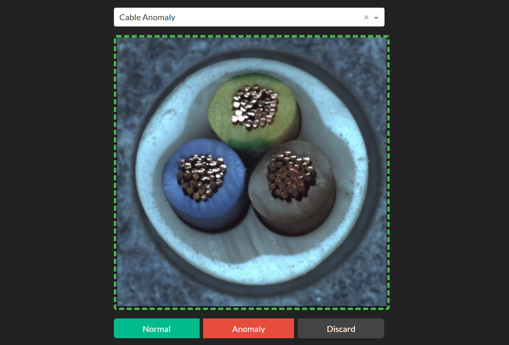
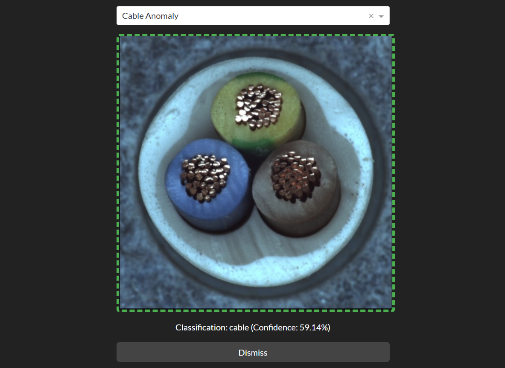

# Anomaly Detection Web App
This is a simple web application for classifying images from a webcam feed in order to select an anomaly detection model. The app allows users to capture images, classify them, and validate them against a selected model.

## Features
- Live webcam feed with capture functionality
- Classification of captured images using a classification API
- Validation of images against an anomaly detection API
- Display of classification and validation results
- Ability to label images as anomalies or normal and submit as new training data to an S3 bucket

# App Structure
## Live Feed
The live feed displays the webcam stream. 

- **Capture**: Takes a snapshot of the webcam feed and opens the capture panel.
- **Classify**: Sends the captured image to the classification API for analysis. On response from the classification API, the app displays the classification result panel, and selects the validation model from the dropdown. 
- **Validate**: Captures an image and sends it to the anomaly detection API, displaying the validation result panel.

## Capture Panel
The capture button takes a snapshot of the webcam feed and opens the capture panel. Here the user can submit new images to the S3 bucket as training data for the selected anomaly detection model and the classification model.

- **Anomaly**: Labels the captured image as an anomaly and sends it to the S3 bucket.
- **Normal**: Labels the captured image as normal and sends it to the S3 bucket.
- **Discard**: Discards the captured image and returns to the live webcam feed.

## Classification Result Panel
The classification result panel displays the captured image and the classification result.

- **Dismiss**: Returns to the live webcam feed.

## Validation Result Panel
The validation result panel displays the image returned from the anomaly detection API, the validation text result, and the selected validation model. It has a single button:
- **Dismiss**: Returns to the live webcam feed.

